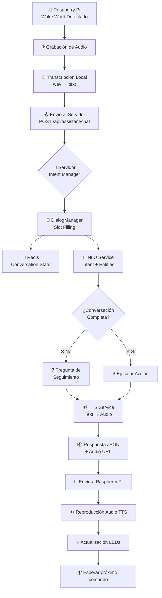

# 📝 STATUS_QUO.md

> **Fecha de actualización:** 2025-07-03
>
> Este documento resume el estado **actual** del proyecto *Puertocho Voice-Assistant*, cubriendo avance funcional, infraestructura, configuraciones clave y próximos pasos.

---

## 1. Visión general

El asistente funciona en Raspberry Pi con dos versiones disponibles:

1. **🎯 wake-word-porcupine-version (ACTIVA)**:
   - Detección de wake word con Porcupine
   - Soporte para conversaciones multivuelta
   - Integración con TTS y slot-filling
   - Modo fallback a comandos locales

2. **⏳ wake-word-openWakeWord-version (EN DESARROLLO)**:
   - Entrenamiento de modelo personalizado "Puertocho"
   - Fase 5 (entrenamiento) en curso con GPU en Google Cloud

---

## 2. Progreso por Fase

| Fase | Descripción | Estado |
|------|-------------|--------|
| 1 | Preparación del entorno | ✅ Completada |
| 2 | Integración básica `openWakeWord` | ✅ Completada |
| 3 | Integración con lógica del asistente | ✅ Completada |
| 4 | Optimización & robustez | ✅ Completada (penden subtareas menores de optimización) |
| 5 | Entrenamiento modelo "Puertocho" | 🔄 En progreso (test simplificado ✅) |
| 6 | Validación & despliegue | ⏳ Pendiente |
| 7 | Mejoras avanzadas | ⏳ Pendiente |

### **Entrenamiento simplificado (03-Jul-2025)**
- Se creó `simple_trainer.py` evitando dependencias conflictivas.
- Dataset usado para test: 100 positivos + 200 negativos.
- Resultado: Loss 0.27 / Acc 68% en 5 épocas.
- Modelo generado: `test_models/puertocho_test_best.pth` (704 KB).
- Próximo paso: entrenamiento completo con 503 positivos + 5 000 negativos.

---

## 3. TODOs activos

| ID | Tarea | Estado | Dependencias |
|----|-------|--------|--------------|
| generate_positive_samples | Generar ~2000 muestras positivas vía TTS | pending | setup_training_environment |
| download_negative_dataset | Descargar/limpiar Common Voice ES | pending | setup_training_environment |
| train_puertocho_model | Entrenar modelo personalizado | pending | generate_positive_samples,<br/>download_negative_dataset |
| validate_model_performance | Validar métricas del modelo | pending | train_puertocho_model |
| integrate_custom_model | Integrar modelo en RPi & ajustar threshold | pending | validate_model_performance |
| integrate_user_samples | Integrar 103 muestras grabadas por el usuario | completed | generate_positive_samples |

*Nota:* Todos los elementos de Fases 1-4 y los test automatizados aparecen como **completed** en el tracker.

---

## 4. Configuración actual en Raspberry Pi

### 4.1 Configuración Porcupine (ACTIVA)

| Parámetro | Valor |
|-----------|-------|
| `PORCUPINE_ACCESS_KEY` | Requerido (configurar en `.env`) |
| `ASSISTANT_CHAT_URL` | `http://192.168.1.88:8080/api/assistant/chat` |
| `TRANSCRIPTION_SERVICE_URL` | `http://192.168.1.88:5000/transcribe` (fallback) |
| Wake words | "Hola Puertocho", "Oye Puertocho" |
| Fallback wake words | "Hey Google", "Alexa" |
| Audio | 16 kHz, 1 canal, 512 samples |
| GPIO | Botón 22, LED verde 17 (IDLE), LED rojo 27 (RECORD) |
| Detección silencio | WebRTC VAD nivel 2 |
| Cool-down detección | 0.8 segundos |

### 4.2 Configuración OpenWakeWord (EN DESARROLLO)

| Parámetro | Valor |
|-----------|-------|
| `OPENWAKEWORD_THRESHOLD` | **0.6** |
| Cool-down detección | **8 s** (implementado en `app/main.py`) |
| Modelos activos* | `alexa`, `hey_mycroft`† |
| VAD | Deshabilitado (`threshold=0.0`) |
| Speex Noise Suppression | `false` |
| Inference framework | `onnx` |
| Audio | 16 kHz, 1 canal, 1280 samples (80 ms) |
| GPIO | Botón 22, LED verde 17 (IDLE), LED rojo 27 (RECORD) |

\* Se espera reemplazarlos por `checkpoints/puertocho.onnx` cuando el modelo esté listo.
† Wake-words genéricas empleadas sólo para pruebas temporales.

### Servicios & Scripts relevantes

- `scripts/monitor_performance.py` → métricas CPU/GPU, temperatura, RAM.
- `scripts/auto_optimizer.py` → auto-ajuste de parámetros (`threshold`, VAD, etc.) según métricas.
- Docker Compose con `network_mode: host` y dispositivos ALSA/GPIO expuestos.

---

## 5. Sistema Conversacional Implementado

### 5.1 Arquitectura



### 5.2 Estructura de datos

#### ChatRequest (Raspberry Pi → Servidor)
```json
{
  "message": "enciende las luces",
  "sessionId": "uuid-de-sesion",
  "generateAudio": true,
  "language": "es",
  "voice": "es_female",
  "deviceContext": {
    "deviceType": "raspberry_pi",
    "location": "Casa Principal",
    "room": "Salón",
    "isNightMode": false,
    "capabilities": {
      "hasAudio": "true",
      "hasGPIO": "true",
      "hasLEDs": "true",
      "platform": "Linux"
    }
  }
}
```

#### ChatResponse (Servidor → Raspberry Pi)
```json
{
  "success": true,
  "message": "¿En qué habitación quieres que encienda la luz?",
  "sessionId": "uuid-generado",
  "audioUrl": "http://servidor/audio/response.wav",
  "ttsService": "f5_tts",
  "conversationState": "slot_filling",
  "extractedEntities": {"accion": "encender"},
  "missingEntities": {"lugar": "habitacion"},
  "suggestedAction": null,
  "metadata": {}
}
```

### 5.3 Modos de operación

1. **🎯 MODO CONVERSACIONAL (Recomendado)**
   - Endpoint: `/api/assistant/chat`
   - Funciones:
     - Conversaciones multivuelta
     - Slot-filling inteligente
     - Respuestas TTS
     - Contexto del dispositivo
     - Gestión de sesiones

2. **🔄 MODO FALLBACK**
   - Endpoint: `/transcribe`
   - Funciones:
     - Transcripción directa
     - Comandos predefinidos
     - Sin estado de conversación
     - Sin TTS

El sistema detecta automáticamente qué servicios están disponibles y usa el mejor modo posible.

---


> Fin del reporte. Mantener este archivo actualizado conforme avance el proyecto. 